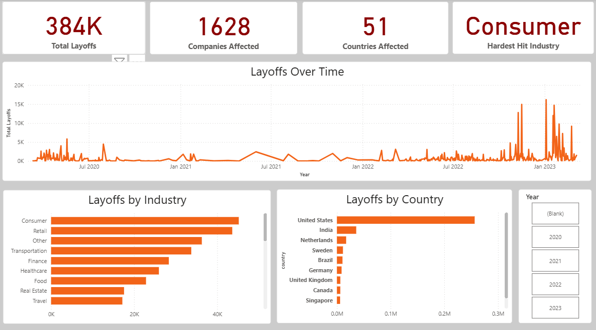
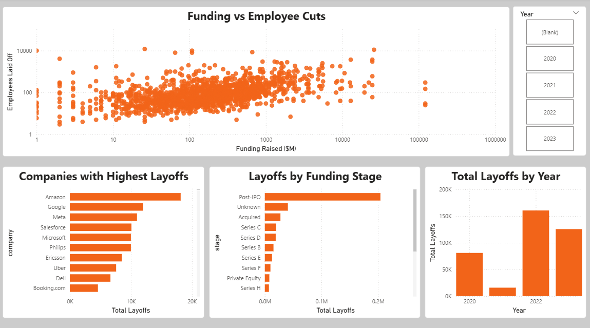

# Power BI Dashboard

This dashboard analyzes global tech layoffs from 2020–2023 using interactive visualizations built in Power BI.

# Dashboard Preview

## Overview Page

## Deep Dive Page

### Overview
- KPI summary
- Layoff trends over time
- Country and industry analysis

### Deep Dive
- Funding vs layoffs scatter plot
- Top companies by layoffs
- Funding stage analysis
- Yearly comparisons

## Features
- Interactive slicers
- Cross-filtering visuals
- DAX measures
- Data modeling using relationships
